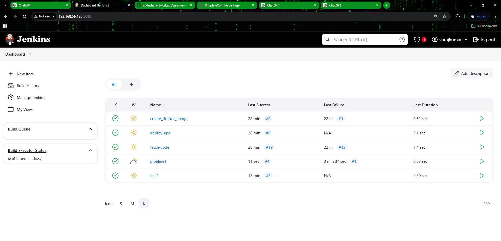
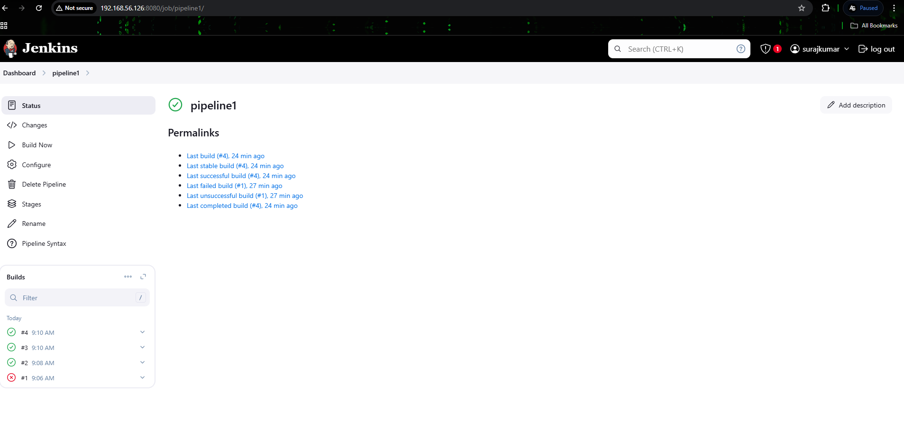
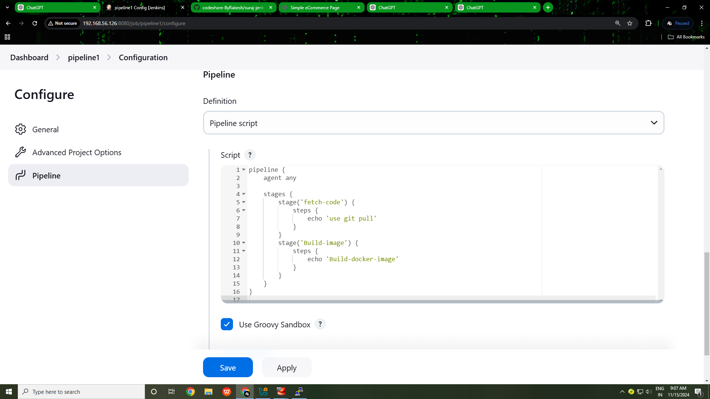
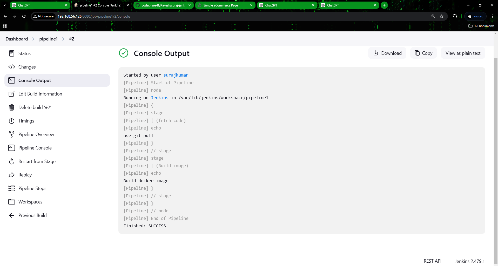
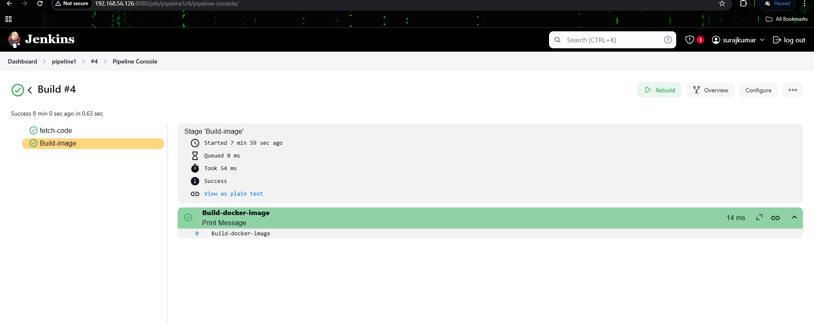
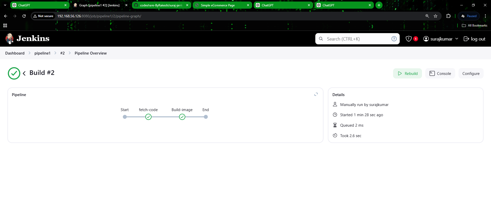

## Jenkins Declarative Pipeline:


Set up a Jenkins Declarative Pipeline for a Docker-based CI/CD workflow. Created a multi-stage pipeline with code fetching and Docker image building, automated triggering using SCM polling and GitHub webhooks, and ensured efficient debugging via console logs.


## Prerequisites
*Before setting up the Pipeline job, ensure to checkout first, we’ve already implemented and understood Freestyle jobs in Jenkins.*

*Freestyle jobs are simpler but lack the advanced flexibility of Pipeline jobs.*

Below is a brief comparison:


| **Feature**          | **Freestyle Job**               | **Pipeline Job**                     |
|-----------------------|----------------------------------|---------------------------------------|
| **Flexibility**       | Limited                        | Highly customizable                  |
| **Code Definition**   | Configured via GUI             | Defined as code (Groovy script)      |
| **Complex Workflows** | Not ideal for multi-stage processes | Perfect for multi-stage workflows    |


### Pipeline Item Option in Jinkins:
*The Pipeline item in Jenkins allows you to define and manage complex workflows as code. This is a better alternative to Freestyle jobs for CI/CD tasks like building and deploying Docker images.*


### Steps to Implement:


### Step 1: Create a New Jenkins Pipeline Job

#### 1. Create a New Job
  1. Navigate to Jenkins Dashboard:
      - Open your Jenkins instance in a browser (e.g., http://localhost:8080).
  2. Click "New Item":
      - From the Jenkins dashboard, click on the New Item option on the left-hand menu.
  3. Choose Job Type and Name:
  - In the "Enter an item name" field, type the name of your job (e.g., docker-build-pipeline).
  - Select Pipeline as the job type.
  - Click OK to proceed.


2. Configure the Pipeline
    - Once the job is created, you will be directed to the Pipeline Configuration page.

    - Scroll to the "Pipeline" Section:
      - Locate the Pipeline section at the bottom of the page.
    -  Choose Pipeline Definition:
      - Under the Definition dropdown, select Pipeline script.
      - This option allows you to write or paste your pipeline script directly.
  3. Paste the Pipeline Script:
      - In the "Script" textbox, input the pipeline script provided below.

### Step 2: Write the Pipeline Script
   *Here’s the Groovy pipeline script:*

```yml

pipeline {
    agent any  // Defines that the pipeline can run on any available agent

    stages {
        // Stage 1: Fetch Code
        stage('fetch-code') {
            steps {
                echo 'Fetching code from the repository...'
            }
        }

        // Stage 2: Build Docker Image
        stage('build-image') {
            steps {
                echo 'Building Docker image...'
            }
        }
    }
}


```
   


### Step 3: Save and Build the Job
1. Save the Job:
   - Scroll down and click Save to finalize the job configuration.
2. Run the Pipeline:
   - Go back to the Jenkins dashboard.
   - Click on your job (e.g., docker-build-pipeline).
   - Click Build Now to start the pipeline.
3. Monitor Progress:
   - View build progress in the Build History section.
   - Check Console Output for logs.


### Step 4: Automate Triggering
  - To ensure seamless CI/CD, automate the pipeline using triggers.

#### a. SCM Polling. (option-1)
   1. In the Build Triggers section of the job configuration, enable Poll SCM.
   2. Set up a schedule using cron syntax, e.g., H/5 * * * * (poll every 5 minutes).
#### b. GitHub Webhook. (option-2)
   1. In GitHub, navigate to Settings > Webhooks.
   2. Click Add webhook and configure it as follows:
       - Payload URL: Enter your Jenkins webhook URL (e.g., http:// jenkins- 
         url/github-webhook/).
       - Trigger: Select Push events.
   3. Save the webhook to enable automatic builds when new code is pushed.
Script.


### Script Explanation
1. pipeline {}: The root block defining the pipeline.
2. agent any: Specifies the environment where the pipeline will run.
3. stages {}: Contains multiple stages, each representing a task.
  - fetch-code: Clones the repository.
  - build-image: Builds a Docker image.
  - deploy: Runs the Docker container.
4. steps {}: Defines the actions performed in each stage.


#### Debugging
1. Console Output: Check logs for issues.
2. Common Errors:
   - Incorrect repository URL or credentials.
   - Missing Docker permissions on the Jenkins server.


*By following these steps, you will set up a fully automated Jenkins pipeline for Docker-based CI/CD workflows.*


<br>
<br>
<br>


## ------------------Screnshots--------------------
1.
<br>
<br>




2.
<br>
<br>





3.
<br>
<br>




<br>
<br>


4.
<br>
<br>




<br>
<br>

5.
<br>
<br>




<br>
<br>


<br>
<br>

6.
<br>
<br>





<br>
<br>


<br>
<br>
<br>
<br>


**👨‍💻 𝓒𝓻𝓪𝓯𝓽𝓮𝓭 𝓫𝔂**: [Suraj Kumar Choudhary](https://github.com/Surajkumar4-source) | 📩 **𝓕𝓮𝓮𝓵 𝓯𝓻𝓮𝓮 𝓽𝓸 𝓓𝓜 𝓯𝓸𝓻 𝓪𝓷𝔂 𝓱𝓮𝓵𝓹**: [csuraj982@gmail.com](mailto:csuraj982@gmail.com)


<br>

